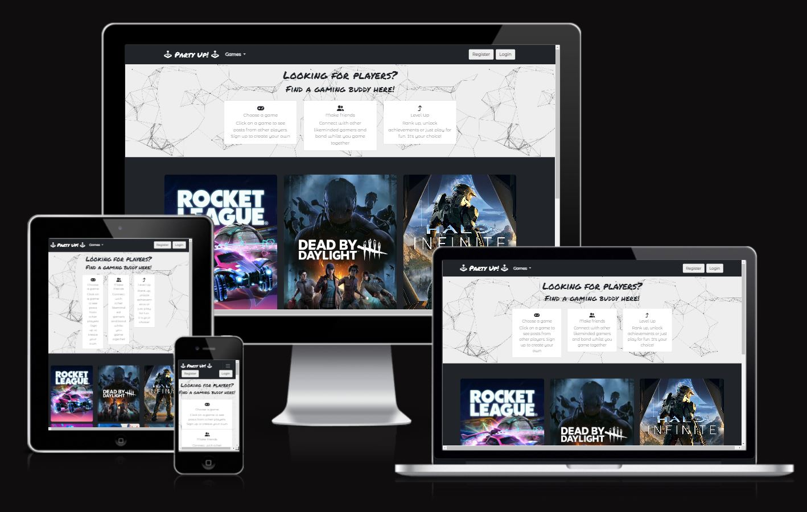

# Party Up!

Welcome to Party Up! 

Any gamer will tell you about the dangers of "solo queuing" and how quickly it can erode the ranks that you've diligently earned. We here at Party up want to remind you of something we all forgot a long time ago, before the COVID, before the internet, before God of War: Video games are better with your friends!

Enter Party Up! The one stop shop for :

* Meeting likeminded gamers and making friends
* Putting together crack squads to push the limits of your skill level and boost your ranking
* Trophy Hunting or Achievement Unlocking. Here you can team up and smash out those multiplayer goals with ease.
* Fun - so you don't want a new BFF, nor care about high-level gaming. That's alright. Here you can find other people who also just want to mess around

Party Up is a full-stack software development project that has been built using Django and Bootstrap frameworks, with additional HTML, CSS and JavaScript. 

You can visit the live website [here](https://partyupgaming.herokuapp.com/)

# Contents

# UX

The project has been completed using the core UX principles to ensure an efficient and easy to use app was created that had a distinct purpose and provided satisfaction to users

## Strategy 

Goals -
Mobile first design
Agile work

## Target Audience

The target audience of this website is any person who :

* enjoys online video games
* wants to meet other gamers and make friends
* is looking for a team mate for ranked play
* is looking for a team mate for trophy/achievement hunting

## User Stories

* As an unregistered user I can view each post on the website so that I can select one to read and decide whether to sign up
* As a user I can navigate intuitively so that I can view the desired content
* As a logged in user I can change the details on my profile page so that all my details and information are up to date
* As a logged in user I can view my profile page so that I can see my personal account details
* As an admin I can create, remove, update or delete posts so that I can ensure site content is relevant and inoffensive
* As an Admin I can log out of the admin panel so that I can disconnect from the website
* As an admin I can log in so that I can access the sites backend
* As a user I can access social media accounts connected to the website so that I may learn more about the company
* As a user I can quickly identify the purpose of the website from the landing page so that determine if the website is relevant to me
* As a registered user I can login and logout of my account so that I can access and keep secure my data
* As a registered user I can set a password so that so that my account is secure
* As a registered user I can request a new password in case I forget my own so that I can regain access to my account
* As a user I can contact the website so that I can provide feedback or present queries
* As an unregistered user I can create an account so that I can interact fully with the website
* As an unregistered user I can easily find the sign up page so that I can register and interact with the website
* As a user I can fill in my personal details on my account page so that I can auto populate forms with my information on the site
* As a registered user I can delete my account so that ensure my details are removed after I no longer want to use it
* As a registered user I can comment on posts so that I can connect with other gamers
* As a registered user I can delete my posts so that my post are no longer visible and I will receive no further messages
* As a registered user I can update my posts so that I can keep my posts relevant and up to date with information
* As a registered user I can create posts so that I can find other gamers who want to achieve the same things
* As a user I can easily see if I am logged in or not so that I can choose to login or logout depending on what I want to do

An agile approach was used for creating this website. The project board can be found here: [Kanban](https://github.com/users/LordButley/projects/1/views/1)

## Structure

## Skeleton

# Features

## Existing Features

### Home page and menu

### How to use

### Data and Database

## Features to implement in the future

## Technologies Used

 ### Languages Used:

 1. [Python](https://en.wikipedia.org/wiki/Python) 
      - Programming language providing content and logic of project

 2. [HTML](https://en.wikipedia.org/wiki/HTML) 
 - Programming language providing content and structure of website.

 3. [CSS](https://en.wikipedia.org/wiki/CSS) 
 - Programming language providing styling of website.

 4. [JavaScript](https://en.wikipedia.org/wiki/Javascript)
 - Programming language used for the functions and interactivity behind the quiz.
 
 ### Frameworks, Libraries & Programs Used:

    
 1. [GitPod](https://gitpod.io/)
    - IDE (Integrated Development Environment), for writing, editing and saving code.

 2. [GitHub](https://github.com/) 
    - Remote code repository.

 3. [Heroku](https://www.heroku.com/)
    - Cloud application platform used to host program

 4. [app.diagram.net](app.diagram.net)
    - Used to create process diagram. 

 5. Python Libraries:
    - os - Used to clear the terminal
    - time - Used for creating a timer
    - random - Used to randomise questions
    - prettytable - Used for the leaderboard
    - string - Used for capitalizing input to match that of the database
    - gspread and google.oauth2.service_account for linking google sheets

 6.[http://pep8online.com/](http://pep8online.com/)
    - PEP8 Validator used to check code for compliance

## Testing

The testing process can be seen in the [TESTING.md](TESTING.md) document.

## Deployment

### Heroku
The site is hosted using Heroku, deployed directly from the master branch of GitHub. The deployed site will update automatically as new commits are pushed to the master branch.

#### How I deployed my project to Heroku.
To host on Heroku you must follow these steps:

#### Updating dependencies for Heroku deployment

1. Create a requirements.txt file in the home directory of project
2. In the terminal write : pip3 freeze > requirements.txt

#### Creating a Heroku App

Heroku was used to deploy the site and it was achieved by following the steps below:

Heroku was used to deploy the site and it was achieved by following the steps below:
  1.	Go to the Heroku's website.
  2.	Create an account if required or select log in.
  3.	From the Heroku dashboard, click on the “New” button in top righthand corner then "Create new app".
  4.	Enter a unique "App name" and "Choose a region" before clicking on "Create app".
  5.	Go to "Config Vars" under the "Settings" tab.
  6.	Click on "Reveals Config Vars" and enter the following information:
	      - CLOUDINARY_URL : add your cloudinary key here.
        - DATABASE_URL : add the url from postgres database.
        - SECRET_KEY = a secret key for your app.
        - PORT : 8000
        - DISABLE_COLLECTSTATIC = 1 during development (Remove when deploying production!)
  7.	Go to "Buildpacks" section and click "Add buildpack".
  8.	Select "/herokupython" and click "Save changes"

- Project Version Control – Git was used to control the versions of the project during development. Changes were added, committed, and saved using commands such as ‘git add .’ and ‘git commit’, and ‘git push’. Once changes had been committed, they were pushed and stored on the GitHub repository with the rest of the projects source code.

#### Deploy section

1. Click on Github under deployment method
2. Search for repository and then click on "connect"
3. Click on "Enable Automatic Deploys"

#### Forking a GitHub Repository
1. Login to GitHub.
2. Locate your desired repository.
3. Locate the fork option in the top-right hand corner of the repository page.    
4. You will be asked where you want to fork it to.

## Credits

### Code

### Thanks

- to tutor support at Code Institute. I have constantly found their positivity and genuine interest in helping resolve issues in my code a great help 
- to my mentor, Richard Wells, who reviewed my project and gave feedback.
- to my partner who is always willing to test everything I create 